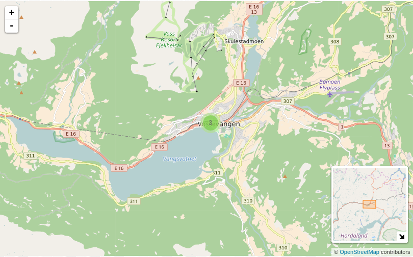
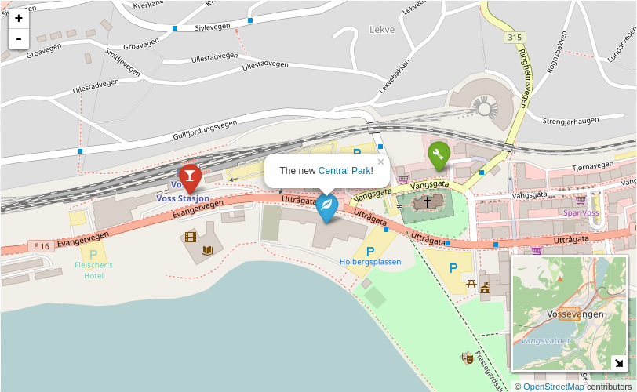

# WordPress Plugin Awesome Cluster Map (OpenStreetMap, Leaflet)

WordPress plugin to create awesome marker cluster maps with OpenStreetMap (OSM).
This plugin is build with [Leaflet](http://leafletjs.com/) as OSM JavaScript
library and [Leaflet.markercluster](https://github.com/Leaflet/Leaflet.markercluster)
and [Leaflet.awesome-markers](https://github.com/lvoogdt/Leaflet.awesome-markers)
to cluster pretty markers. Additionally [Leaflet-MiniMap](https://github.com/Norkart/Leaflet-MiniMap)
is used for showing an overview map.

### Setup

* (Install development requirements: `npm install`)
* Install requirements: `bower install`

### Usage

#### Example

Lets create a map with the initial center of the location 60.628 latitude and
6.41 longitude and add three markers to this map:
```
[cluster_map center="60.628,6.41" zoom=12 height="500px"]
60.62888,6.41035,glass,red,Beach Bar
60.62849,6.414089,leaf,blue,The new <a href="#example">Central Park</a>!
60.62919,6.41716,wrench,green,My first marker
[/cluster_map]
```

The markers are in CSV format:

* latitude
* longitude
* icon ([Bootstraps glyphicons](http://getbootstrap.com/components/#glyphicons), e.g. use `glass`)
* color of the marker (e.g. `red`)
* text for the popup





#### Options

| Name      | Default | Description                                     |
|-----------|---------|-------------------------------------------------|
| `center`  | "0,0"   | Initial center (latitude, longitude) of the map |
| `zoom`    | 3       | Initial zoom of the map                         |
| `height`  | "500px" | Height (CSS value) of the map                   |
| `width`   | "100%"  | Width (CSS value) of the map                    |
| `line`    | "false" | "true" to connect markers by a line             |
| `minimap` | "true"  | "false" to hide overview map                    |